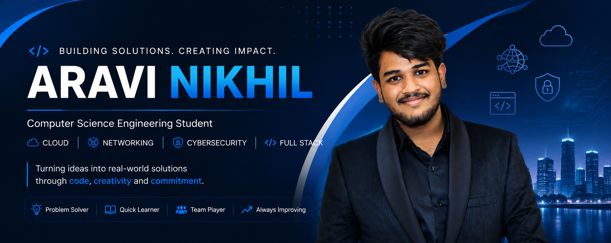

<!-- Banner -->

  

<h1 align="center">Hi 👋, I'm Aravi Nikhil</h1>

<h3 align="center">
Computer Science Engineering Student  
Passionate about Cloud ☁️ • Networking 🌐 • Full Stack Development 💻
</h3>

  
  
  
  

  

---

# 👨‍💻 About Me

- 🎓 B.Tech Computer Science Engineering student at **GITAM University**
- ☁️ Interested in **Cloud Computing**
- 🌐 Passionate about **Computer Networking**
- 💻 Learning **Full Stack Development**
- 📚 Continuously improving my problem-solving and DSA skills
- 🚀 Love building real-world software projects

---

# 🛠️ Tech Stack

### Languages

### Frameworks & Tools

### Cloud & Platforms

---

# 🚀 Featured Projects
<table>
<tr>

<td width="50%" valign="top">

## 🚗 Smart Parking System

A web-based parking management solution designed to simplify the parking experience through real-time booking and secure digital services.

### Key Features
- 🚘 Real-time parking slot booking
- 💳 Secure Razorpay payment integration
- 📱 QR code generation for seamless entry
- 📜 Booking history with vehicle details
- 📍 Location-based parking selection
- 📱 Fully responsive and user-friendly interface

### Technologies
HTML • CSS • JavaScript • Razorpay API

</td>

<td width="50%" valign="top">

## 🌍 Disaster Management & Alert System

A disaster response platform developed to improve emergency communication and provide timely alerts during natural disasters.

### Key Features
- 🚨 Emergency alert notifications
- 📍 Disaster location tracking
- 🗺️ Interactive map visualization
- 📞 Emergency contact information
- 📢 Awareness and safety guidelines
- 👥 Simple interface for quick access

### Technologies
HTML • CSS • JavaScript

</td>

</tr>
</table>

---

# 🏆 Certifications

- AWS Academy Cloud Foundations
- ServiceNow IT Service Management (ITSM)

---

# 📊 GitHub Statistics

  
  

---

# 🔥 GitHub Streak

---

# 📈 Contribution Graph

---

# 🐍 Contribution Snake

---

# 📫 Connect With Me

---

### ⭐ Thanks for visiting my profile!

*"Learning today. Building for tomorrow."*

